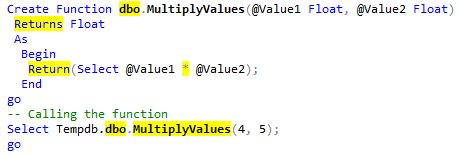

Name: Iryna Taratuta  
Date: August 25, 2022  
Class: IT FDN 130 A Su 22: Foundations Of Databases & SQL Programming  
Assignment: 07  
Github: [DBFoundations-Module07](https://github.com/HombreSQL/DBFoundations-Module07) (External Site)  
# SQL User Defined Functions 
## Intro  
In this article, I will explain when you would use a SQL UDF and the differences between Scalar, Inline,   and Multi-Statement Functions.  
## UDF
**User-defined function (UDF)** is an object stored in the database to avoid writing the same code again. It comes in handy 1) when you work with check constraints that span multiple tables, or 2) when you want to filter on a function problematically from some application.
  
Benefit of user-defined function is modular programming. You can create the function once, store it in the database, and call it any number of times in your program. User-defined functions can be modified independently of the program source code.  
  
SQL Server user-defined functions are routines that accept parameters, perform an action, such as a complex calculation, and return the result of that action as a value. The return value can either be a single (*scalar*) value or a result set (*table of values*).  
## Scalar, Inline, and Multi-Statement Functions
There are three types of user-defined functions: **Scalar, Inline, and Multi-Statement**. 
  
A ***scalar user-defined function*** returns a single (scalar) value of the type defined in the RETURNS clause. Note: In MS SQL, you must use the schema name in scalar UDFs, like **dbo**. (Figure 1)  
  

  
***Figure 1. Example of scalar user-defined function syntax.*** 
  
There are two types of table valued functions which are ***inline table valued function*** (Inline TVF) and ***multi-statement table valued function*** (multi-statement TVF).

1) User-defined ***inline table-valued function*** returns a table which value is derived from a single SELECT statement.  
  
For an ***inline scalar function***, the returned scalar value is the result of a single statement.  
Since the return value is derived from the SELECT statement, there is no BEGIN/END block needed in the CREATE FUNCTION statement. There is also no need to specify the table variable name (or column definitions for the table variable) because the structure of the returned value is generated from the columns that compose the SELECT statement.  
  
2) A ***multi-statement table-valued*** user-defined function returns a table. It can have one or more than one SQL statement. Within the create function command you must define the table structure that is being returned. After creating this type of user-defined function, we can use it in the FROM clause unlike the behavior found when using a stored procedure which can also return record sets. 
    
For a ***multi-statement scalar function***, the function body can contain a series of SQL statements that return the single value. The return type can be any data type except **text**, **ntext**, **image**, **cursor**, and **timestamp**.  
## Summary  
There are three types of user-defined functions: Scalar, Inline, and Multi-Statement. UDF is an object that can compute a result or extract and return a subset of rows.
  
    
**References to external sites, 2022:**  
1) [sqlshack.com](https://www.sqlshack.com/learn-sql-user-defined-functions/)
  
4) [docs.microsoft.com](https://docs.microsoft.com/en-us/sql/relational-databases/user-defined-functions/user-defined-functions?view=sql-server-ver16)
  
3) [blogspot.com](https://excelkingdom.blogspot.com/2018/01/how-to-create-scalar-inline-and-multi.html)
  
5) [techcommunity.microsoft.com](https://techcommunity.microsoft.com/t5/sql-server-support-blog/query-performance-and-multi-statement-table-valued-functions/ba-p/316226)
